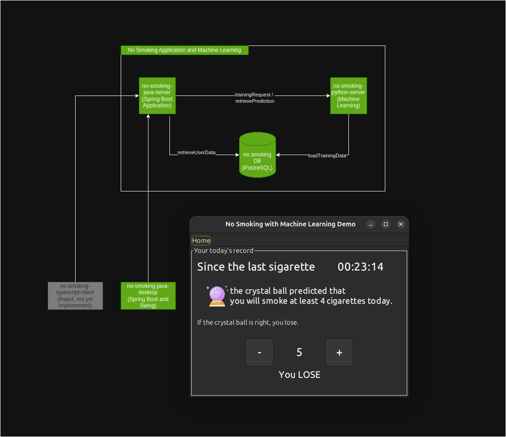

# No Smoking

A set of applications that aim to record and predict, through Machine Learning, the number of cigarettes a user might
smoke.

# First run

- build `no-smoking-java-common`. Gradle will create a jar file in the .m2 directory that will be used by
  `no-smoking-java-desktop` and `no-smoking-java-server` modules.
- move to the `no-smoking-python-server` and run `sudo docker compose up -d` in order to create the containers defined
  in the `docker-compose.yml` file.
- edit the `no-smoking-java-server/src/main/resources/application.yml` file which belongs to the
  `no-smoking-java-server` module.
- run `no-smoking-java-server` and `no-smoking-java-desktop` projects.

# Technologies/Tools

Java, Spring Boot, OpenFeign, hibernate, Spring JPA, PostgreSQL, lombok, git, python, swing.